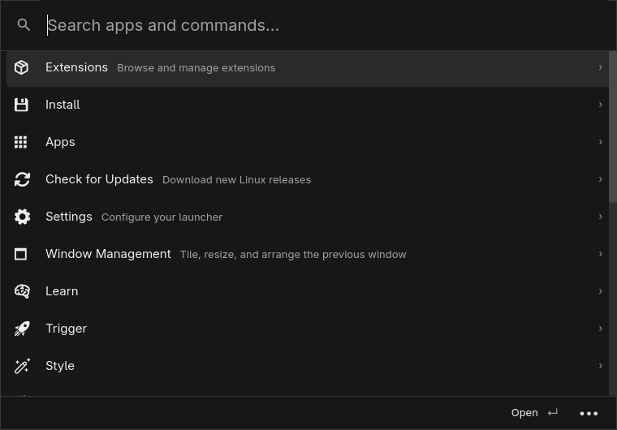

# Command Space

A native launcher for Omarchy, forked from [RustCast](https://github.com/MystikoLab/rustcast). Rust and Iced render the interface; isolated Node.js workers run TypeScript and React extensions.

Command Space uses an opaque charcoal interface with Adwaita Sans, compact search results, and a small action footer inspired by Raycast. Omarchy theme colors and custom overrides remain available in settings. Super+Space opens applications, the complete nested Omarchy menu, and extension commands in one place.



## Features

- Installed applications, fuzzy search, aliases, favorites, shell commands, and custom modes.
- Omarchy’s installed menu definitions and user overrides, including nested Install, Remove, Setup, Learn, Trigger, Style, and System actions.
- Native package, theme, background, plugin, timezone, keybinding, and other system pickers.
- Twenty-four bundled Omarchy workflow commands for application installation, reminders, media conversion, sharing, branding, themes, wallpapers, shell plugins, retro games, DNS, SSH, Windows VM setup, drive passwords, and exact window movement and resizing, plus two developer tools.
- Clipboard history with text and image previews, copy, paste, deletion, and clearing.
- File search, previews, reveal, copy path, and trash actions.
- Emoji search, calculator, unit conversions, and nine launcher positions.
- Window sizing, exact movement and resizing, workspace and display moves, tiling, floating, pinning, and restoring previous bounds.
- Native settings for appearance, shortcuts, placement, search, and commands.
- TypeScript/TSX extensions with React lists, forms, details, grids, actions, navigation, preferences, arguments, storage, and clipboard access.
- List and grid pagination, keyboard form navigation, masked images, and nested action panels.
- Complete Raycast symbol catalog, application and command icons, and cached local and remote images.
- GitHub and local-folder extension installation, updates, and removal.
- OAuth with PKCE and desktop-keyring token storage.
- Configurable AI endpoints with streaming and cancellation.
- Persistent menu-bar extensions, native tray menus, and scheduled background commands.
- Browser tabs and page content through the included Chromium/Firefox bridge.
- Linux release checks, checksum-verified updates, and rollback after installation failures.

The port is under active development. [PORTING.md](docs/PORTING.md) records verified behavior and remaining compatibility work. Extension compatibility depends on the APIs and external programs each extension uses. macOS frameworks and AppleScript are outside the Linux host’s scope.

## Install on Omarchy

Install Rust, Node.js 24 or newer, npm, and the Linux build dependencies listed in [DEVELOPMENT.md](docs/DEVELOPMENT.md), then run:

```sh
bash scripts/install-linux.sh
```

The installer builds an optimized binary, installs the extension runtime, configures a user service, and integrates the Omarchy shortcuts and bar button. Configuration backups are kept in `~/.local/state/command-space/backups`.

Use Super+Space to open the launcher, Super+Ctrl+V for clipboard history, and Super+Ctrl+E for emoji. Open Settings to customize them. Ctrl+K opens actions; Escape goes back.

```sh
command-space show builtin:settings
command-space extension install /path/to/extension
command-space extension install https://github.com/raycast/extensions/tree/main/extensions/json-format
command-space extension update json-format
command-space extension remove json-format
```

Extension sources execute as your user. The installer installs npm dependencies with lifecycle scripts disabled.

## AI extensions

In Settings → Extensions, enter an OpenAI-compatible API base URL and a model identifier. API keys are stored in the desktop keyring. Local providers can be used without a key. Calls to Raycast’s `AI.ask` use the configured model; optional model mappings can be set in `[ai.models]` in the configuration file.

## Browser and background extensions

The installer adds the browser bridge to Omarchy’s existing Chromium extension list. Restart Chromium after installation. Extensions can call `BrowserExtension.getTabs()` and `getContent()` for text, HTML, and Markdown. Native messaging registration is also installed for Chrome, Brave, Edge, Vivaldi, and Firefox; their bridge needs to be loaded separately from `~/.local/share/command-space/runtime/browser-extension` or `browser-extension-firefox`. Chromium and Firefox have been tested in the development VM.

Run a menu-bar command once to enable it. Its tray item continues working after the launcher closes and returns at login. The tray menu includes Refresh, Preferences, and Stop Extension. Commands with a manifest interval run on that schedule after activation.

## Release updates

Search for Check for Command Space Updates or use Settings → About. The launcher checks daily when enabled. Available updates offer release notes and installation; downloads are checked against the release checksum and architecture before replacing the installed files. Failed installations restore the previous binary and runtime.

The Linux release workflow builds ARM64 and x86-64 packages. No Linux release has been published yet. Local packages can be built with `bash scripts/package-linux.sh`; an extracted package installs with `bash scripts/install-linux.sh --prebuilt`.

## Development

For the configured Try Omarchy VM on this Mac:

```sh
ssh omarchy
scripts/dev.sh cargo test --bin command-space
scripts/dev.sh npm --prefix runtime test
scripts/dev.sh bash scripts/install-linux.sh
```

The Mac keeps source files; compilation happens over SSH on the guest’s native filesystem. See [DEVELOPMENT.md](docs/DEVELOPMENT.md) for the shared folder, SSH configuration, desktop testing, and validation commands.

Settings live in `~/.config/command-space/config.toml`. Installed extensions and their data live under `~/.local/share/command-space`. `command-space integration uninstall` removes desktop integration and preserves settings and extension data.

## License

MIT. RustCast’s license and original source attribution are retained. Third-party extensions have their own licenses.
