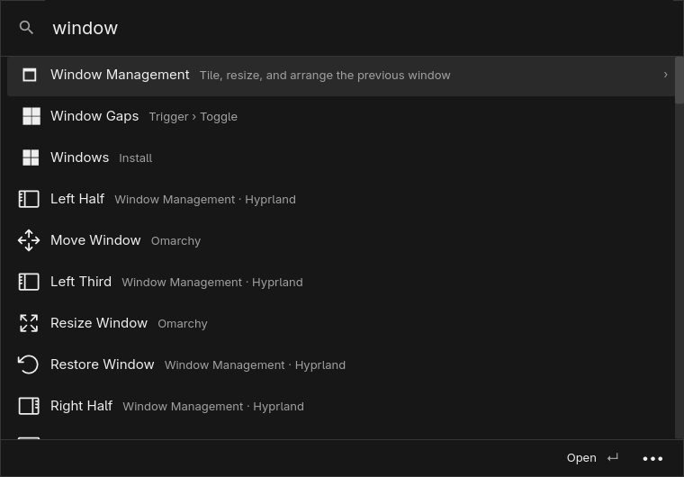
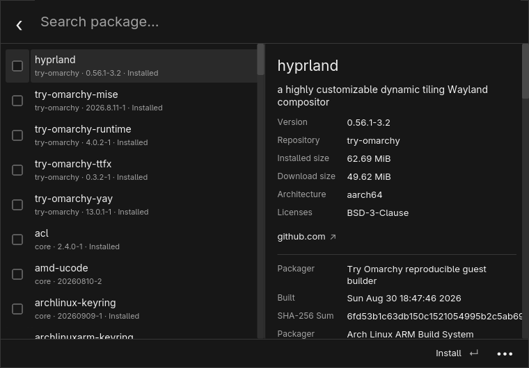

# Command Space

A native launcher optimized for [Omarchy](https://omarchy.org), built in Rust.

Press **Super+Space** to search apps, run commands, and open the Omarchy menu.

- App ranking that learns what you use.
- Indexed file and folder search.
- Omarchy packages, settings, and window controls.
- TypeScript extensions, clipboard history, and a calculator.
- Hide unwanted actions and restore them anytime.

[Download](https://github.com/Aayush9029/command-space/releases) · [Build and install](docs/DEVELOPMENT.md) · [Extension support](docs/PORTING.md)

MIT. Forked from [RustCast](https://github.com/MystikoLab/rustcast).
